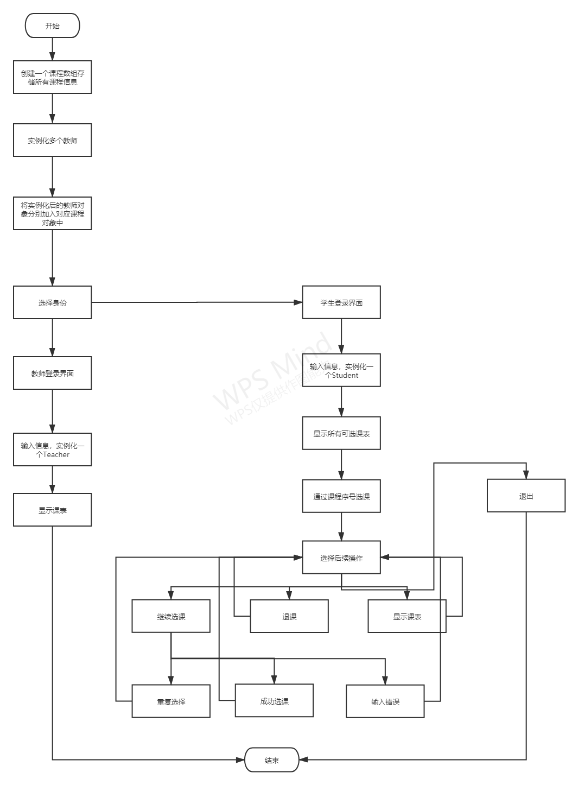
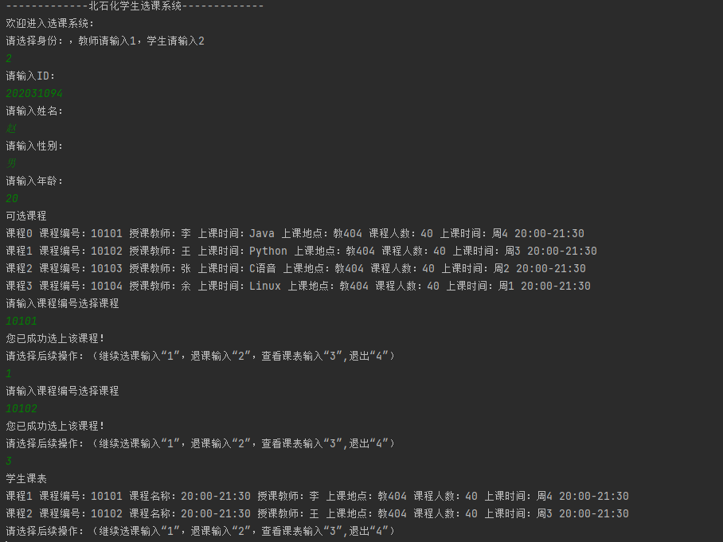
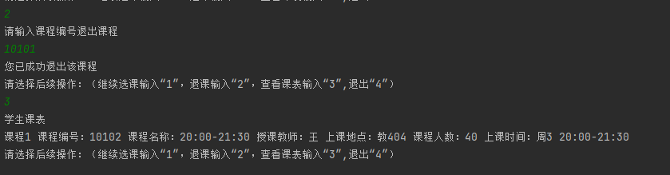

## 一、实验目的
1. 掌握权限访问控制修饰符的使用。
2. 掌握继承的使用。

## 二、业务要求
1. 保持实验二的代码和readme版本不变
2. 新建代码仓库，在实验二代码的基础上完成本次实验
3. 业务过程同实验二，但在类的设计上，采用父类-子类的继承关系定义
4. 测试实体类分别存放于不同的package中，验证权限访问控制、继承后续属性及方法的可见性。

## 三、实验要求
1. 提交源程序到GitHub，代码仓库命名为“实验三 继承关系”。
2. 写实验报告文件（readme.md），体现本次实验在实验二基础上的改进。

## 四、实验过程
1. 首先，创建People父类，通过继承，创建子类Teacher,以及Student。
   将二者相同的属性放入People中，并且将全部属性都设置为私有的(private)。
2. 使用super关键字，以及setID等函数，更改构造函数。创建getID等函数，用于返回每个类的属性值，并将之前直接调用属性的地方换为get函数。
3. 在完成以上更改后，我又对选课系统的查错能力进行了更改，让其可以检测出是否出入错误，以及是否重复输入。
4. 然后将课组里的教师属性，更改为Teacher类的实例化对象，通过调用setTeacher函数的方式，将实例化后的教师，添加到实例化的课程中。
   (first版本是没有修改教师为类的，final版本是修改之后，怕出差错，因此做了两个)

## 五、流程图


## 六、主要代码
1. 设置People父类，将属性设为私有，通过set函数给属性赋值。
``` java
public class People {
    private String name;
    private int id;
    private String sex;

    public People(String name, int id, String sex) {
        setId(id);
        setName(name);
        setSex(sex);
    }

    public String getName() {
        return name;
    }

    public void setName(String name) {
        this.name = name;
    }
}
```
2. 通过extends关键字，继承父类，创建子类，通过super关键字，设置构造函数，给父类和子类中各属性赋值。
``` java
public class Student extends People {
    private int age;
    private Course[] c = new Course[5];
    private int i;

    public Student(int id, String name, String sex, int age) {
        super(name, id, sex);
        setAge(age);
    }
}
```
3. 更改add_course函数，使其容错能力更强。
``` java
    public void add_course(int class_id, Course[] C){
        int q = 0;
        for (int a = 0; a < C.length; a++) {
            if (C[a] == null) {
                break;
            }
            else if (class_id == C[a].getId()) {
                for (int b=0; b<c.length; b++){
                    if(c[0] == null) {
                        c[i] = C[a];
                        i++;
                        System.out.println("您已成功选上该课程！");
                        break;
                    }
                    else if(c[0] != null){
                        if(class_id == c[b].getId()){
                            System.out.println("重复选择，请重新操作！");
                            break;
                        }
                        else if (c[b] == null){
                            break;
                        }

                        else{
                            c[i] = C[a];
                            i++;
                            System.out.println("您已成功选上该课程！");
                            break;
                        }
                    }
                }
                q = 1;
                break;
            }
            else {
                continue;
            }
        }
        if(q == 0){
            System.out.println("课程号输入错误，请重新操作！");
        }
    }

```
4. 将课组里的教师属性，更改为Teacher类的实例化对象。
``` java
public class Course {
    private int id;
    private String name;
    private String place;
    private String time;
    private Teacher teacher;
    private int week;
    private int stu_num;//课程人数

    public void setTeacher(Teacher teacher){
        this.teacher = teacher;
    }
}
```
5. 通过调用setTeacher函数的方式，将实例化后的教师，添加到实例化的课程中。
``` java
        //实例化一堆老师
        Teacher t1 = new Teacher(1001,"李","男");
        Teacher t2 = new Teacher(1002,"王","女");
        Teacher t3 = new Teacher(1003,"张","女");
        Teacher t4 = new Teacher(1004,"余","男");
        //给每门课程分配老师
        c1.setTeacher(t1);
        c2.setTeacher(t2);
        c3.setTeacher(t3);
        c4.setTeacher(t4);
```

## 七、运行截图
&emsp;&emsp;**下面是学生选课运行截图。**



## 八、感想体悟
&emsp;&emsp;本次实验基于第二次实验的升级版，对权限进行修改，在实际运用中使数据更加安全，对于继承关系的运用，提高代码的复用性，编写起来更加简介，同时让编写者更加明白类与类之间的相关性，清楚体现类之间的层次关系。
<br>&emsp;&emsp;希望日后能学习的更加透彻。
